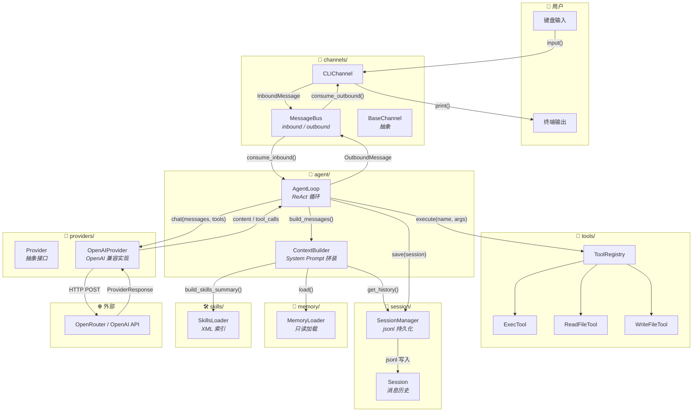
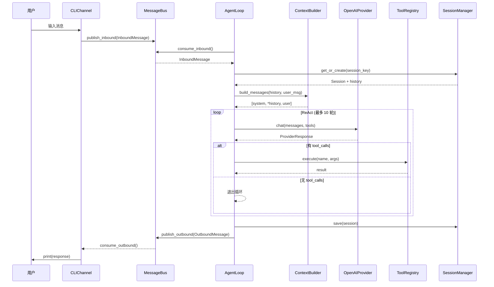
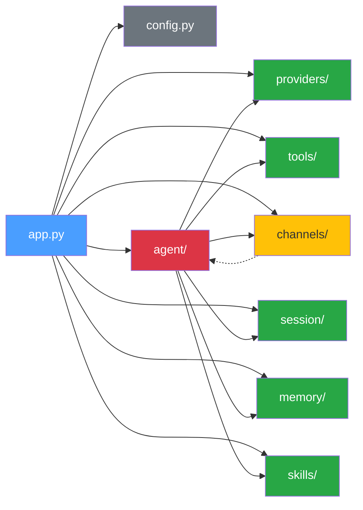

# Picobot 系统架构

## 组件图

## 核心流程

## 依赖方向

**规则：**
- 实线箭头 = 编译时 import 依赖
- 虚线箭头 = 运行时通过 MessageBus 间接通信
- 绿色 = 叶子模块（不被项目内其他模块依赖）
- 红色 = AgentLoop 是调度中枢，依赖几乎所有模块
- 黄色 = Channels 通过队列与 Agent 解耦，AgentLoop 只依赖 `channels.base` 中的 MessageBus/OutboundMessage

## 关键设计决策

| 决策 | 说明 |
|---|---|
| Provider 抽象 | `AgentLoop` 只依赖 `Provider` 接口，OpenAI SDK 锁在 `OpenAIProvider` 里，换模型只需新增一个实现 |
| MessageBus 解耦 | Channel 与 Agent 通过 `asyncio.Queue` 通信，互不感知。加 Telegram/Discord 只需实现 `BaseChannel` |
| ContextBuilder 注入 | `MemoryLoader` 和 `SkillsLoader` 通过构造函数注入，便于测试和替换 |
| 扁平包结构 | 每个模块是项目根的一级 Python 包，导入路径短 (`from tools.base import Tool`)，无需 `pip install` 即可 `python app.py` |
| 只读 Memory | 当前只加载 MEMORY.md 注入 prompt，不提供写入工具。保持极简，写入留给后续迭代 |
